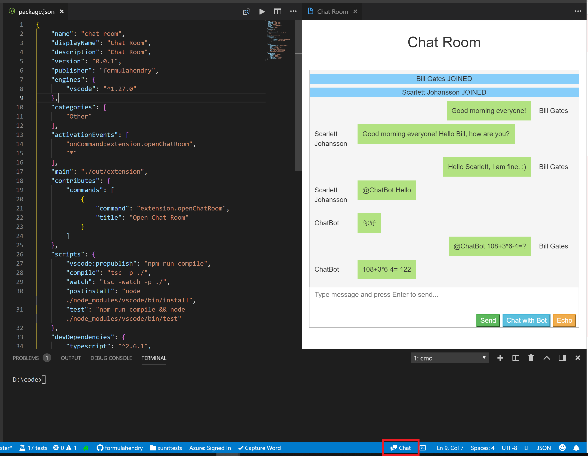

# Chat Room & Chat Bot

Chat with people from all over the world, also chat with the smart Chat Bot.

If you are using Cloud Studio, you could also use the corresponding [Chat Room plugin](https://studio.dev.tencent.com/plugins/detail/446).

## Usage

To open Chat Room in VS Code:
  * click the **`Chat Room`** in the Status Bar at the bottom
  * or press `F1`, then type `Open Chat Room`

## How it works?

* The real-time Chat Room service is bulit on top of [Azure SignalR Service](https://docs.microsoft.com/azure/azure-signalr/)
* the Chat Bot is bulit on top of [Turing Robot API](http://www.turingapi.com/)

##Limitation

Currently, the Chat Bot only works well with Chinese. If you chat with English, it will usually translate it into Chinese. It would be a good English-Chinese translator. :)

## Change Log

See Change Log [here](CHANGELOG.md)

## Issues

Currently, the extension is in the very initial phase. If you find any bug or have any suggestion/feature request, please submit the [issues](https://github.com/formulahendry/vscode-chat-room/issues) to the GitHub Repo.

## Credit

Icons made by <a href="https://www.flaticon.com/authors/dave-gandy" title="Dave Gandy">Dave Gandy</a> from <a href="https://www.flaticon.com/" 			    title="Flaticon">www.flaticon.com</a> is licensed by <a href="http://creativecommons.org/licenses/by/3.0/" 			    title="Creative Commons BY 3.0" target="_blank">CC 3.0 BY</a>
